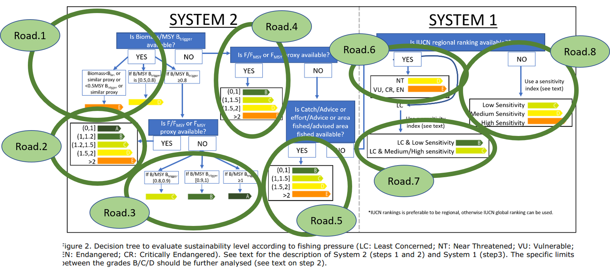

# FPSI

This package will gather and disseminate Scripts used for STECF request about Sustainability Indicators and EU marketing standards for Fisheries product.

```
library(devtools)

devtools::install_github('polehalieutique/FPSI')
```

# Packages data content

This package contains, stock assessment information (F,Fmsy,SSB,MSYbtrigger,landings..) from 

* ICES database (using ICES webservices / Through ICES dedicate packages and websevices)
* NOAA database (using ICES webservices / Through stocksmart packages)
* Balance capacity database set up to calculate SHI indicators for this regular WG

It also contains function that will used these data to process following recommandations :


